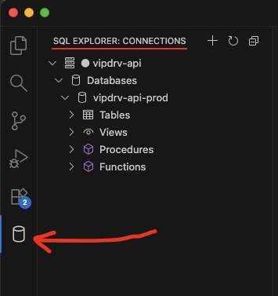
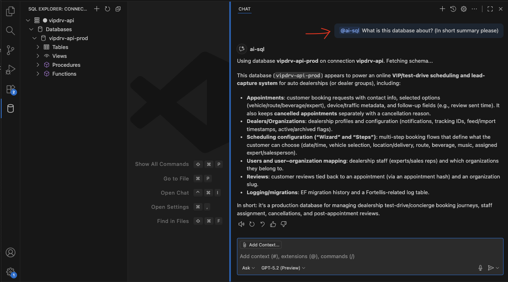
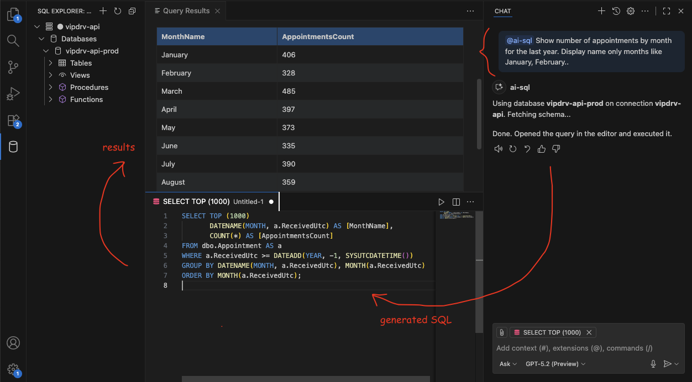

# SQL with AI — Database Explorer + AI Query Assistant

Explore your databases, understand schemas quickly, and turn natural language into runnable SQL — right inside VS Code.

**SQL with AI** is a lightweight SQL client for **SQL Server**, **PostgreSQL**, and **MySQL** with an AI assistant that uses the *currently selected database schema* (including **PK/FK relationships**) to generate accurate queries.

## Why you’ll love it

- **One-click SQL Explorer**: Connections → databases → tables/views/procs/functions
- **Schema-aware AI**: ask questions like “number of orders by product last month” and get executable SQL
- **Context follows you**: selection in the explorer becomes the AI’s context automatically
- **Fast results viewer**: pretty grid, execution time, NULL highlighting

## Screenshots (placeholders)

> Replace these image paths with your actual screenshots.

### SQL Explorer

### Ask in plain English → Get SQL → Run

### Query results

## Key features

### 🌲 SQL Explorer

- Browse **databases**, **tables**, **views**, **procedures**, and **functions**
- Inspect table details: **columns**, **indexes**, and **constraints**
- PK/FK relationships are surfaced and used by the AI assistant to join tables correctly

### 🧠 AI SQL Assistant (Copilot-powered)

In Copilot Chat, talk to the participant **@ai-sql**:

- **Ask for data** (it generates SQL, opens a query editor, and runs it)
  - “Give me the number of appointments by siteslug”
  - “Bring product names by number of orders last month”
- **Ask for understanding** (it explains the database and report ideas)
  - “Explain this database to me. What kind of useful reports can I get?”

The assistant first classifies your intent (query vs metadata question) and responds accordingly.

### 📝 Query editor + execution

- Create a new SQL document from the explorer
- Run the selected text or the whole file
- Results show up in a dedicated panel

## Quickstart

1. Open **SQL Explorer** from the Activity Bar
2. Click **Add Connection**
3. Connect to your database
4. Expand **Databases**, pick one, and start:
   - Right-click → **New Query**
   - or ask **@ai-sql** a question in Copilot Chat

## What it’s great for

- Quickly onboarding into an unfamiliar database
- Building one-off reports and sanity checks
- Exploring PK/FK relationships without leaving the editor
- Turning business questions into SQL without memorizing table names

## Requirements

- Visual Studio Code (recent versions recommended)
- Network access to your database
- For AI features: GitHub Copilot Chat enabled

## Notes & limitations

- The results grid shows up to **1000 rows** for performance.
- If your schema is very large, the AI assistant summarizes it (it’s optimized for accuracy, not dumping everything).

## License

[MIT](LICENSE)

